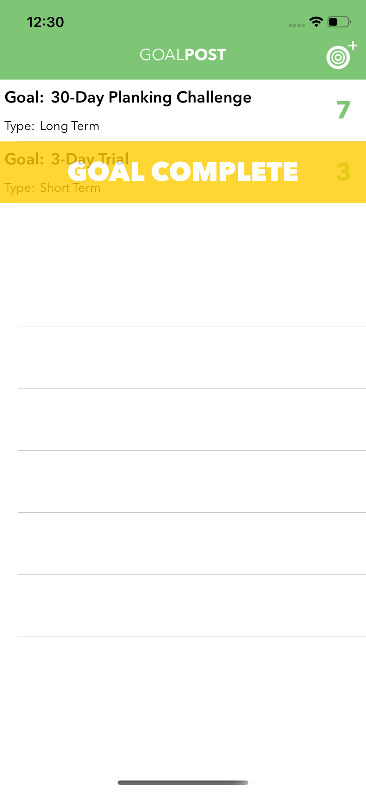

# GoalPost
Goal tracker app - data persistence with Core Data

- core data (tick Core Data checkbox upon project creation; GoalsVC.swift, FinishGoalVC.swift)
- change present view controller animation to slide from right to left and vice versa using UIViewController extension (UIViewControllerExt.swift, GoalsVC.swift, CreateGoalVC.swift)
- present view controller without segue (GoalsVC.swift, CreateGoalVC.swift, FinishGoalVC.swift)
- bind button to keyboard using UIView extension (UIViewExt.swift)
- change button color on select and deselect using UIButton extension (UIButtonExt.swift)

 
 
 
